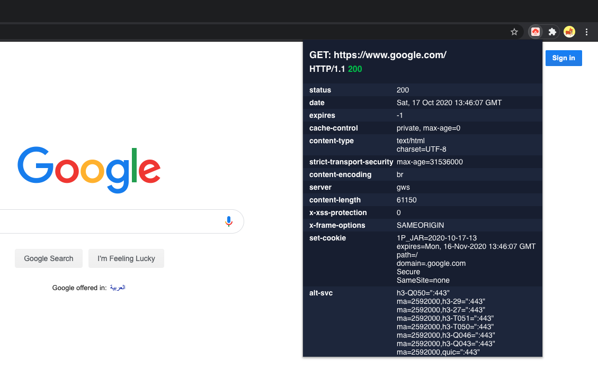
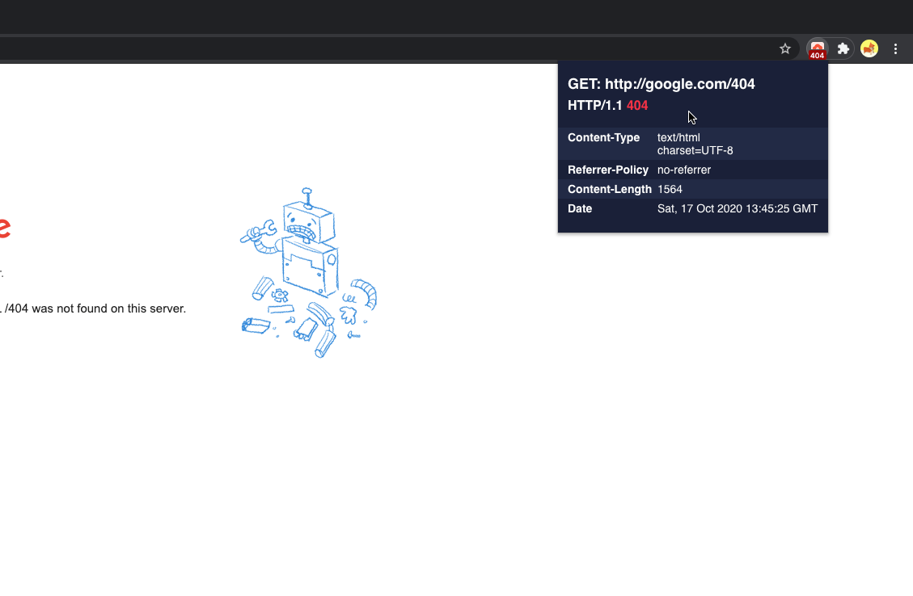
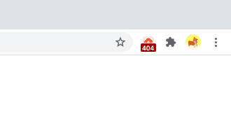
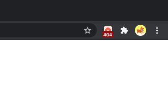

# Minimal HTTP Headers

Chrome extension to view http(s) headers for the current webpage request

# Highlights

- Features a minimal dark design, that uses colors with high contrast
- Shows a badge for pages that have any status code other than 200
- Refreshes automatically when a new response comes in
- Uses an icon that works well for both dark and light mode on Mac
- Open source, and so your security and privacy is guaranteed


# Screenshots









# TODO

- [ ] Track http redirection(s)
- [ ] Provide a light theme
- [ ] Handle SPAs, so that user can see that a certain response is from a previous request, and that the current page is rendered by an SPA

# Build

To start a development server that does hot reloading, do the following. After that load the build folder into chrome as an unpacked extension.

```
npm run start
```

To create a prod build do this:
```
npm run build
```


